# Real-Time Chat — System Guide

A technical breakdown of how this Flask application works: stack, data model, features, function flows, and real-time behavior. Code snippets are taken from this repository.

---

## Table of Contents

1. [System fundamentals](#1-system-fundamentals)
2. [Project structure](#2-project-structure)
3. [Application bootstrap](#3-application-bootstrap)
4. [Data layer (SQLAlchemy + MySQL)](#4-data-layer-sqlalchemy--mysql)
5. [Authentication & accounts](#5-authentication--accounts)
6. [Real-time layer (Socket.IO)](#6-real-time-layer-socketio)
7. [Rooms & chat types](#7-rooms--chat-types)
8. [Messaging](#8-messaging)
9. [Notifications](#9-notifications)
10. [Room invitations](#10-room-invitations)
11. [User blocking](#11-user-blocking)
12. [Profiles & media uploads](#12-profiles--media-uploads)
13. [Admin dashboard](#13-admin-dashboard)
14. [Socket events reference](#14-socket-events-reference)
15. [HTTP routes reference](#15-http-routes-reference)

---

## 1. System fundamentals

### What this app is

A **multi-user chat** web application with:

- Account registration and **email verification** (6-digit code)
- **Public rooms**, **private invite-only rooms**, and **direct messages (DMs)**
- **Real-time** message delivery, typing indicators, and read receipts via **Flask-SocketIO**
- **Notifications** for unread messages, mentions, and room invitations
- **User blocking**, profiles, and an **admin** area

### Technology stack

| Layer | Technology |
|--------|------------|
| Web framework | Flask 3 |
| ORM / DB | Flask-SQLAlchemy → **MySQL** |
| Auth sessions | Flask-Login |
| Forms / CSRF | Flask-WTF |
| Real-time | Flask-SocketIO + Socket.IO client (CDN) |
| Transport (client config) | HTTP **long-polling** (TCP), not UDP |
| Email | `smtplib` (`app/mail.py`) |
| Entry point | `run.py` → `socketio.run(app)` |

### High-level architecture

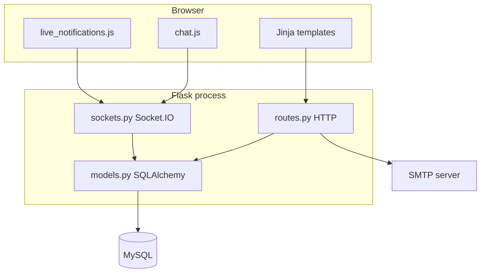

### Request types

| Type | Used for |
|------|----------|
| **HTTP** | Pages, forms, file uploads, initial message history |
| **Socket.IO** | Live messages, typing, read receipts, notification pushes |

Messages are **always stored in MySQL** first (or at the same time as emit); sockets **broadcast** updates—they are not the database.

---

## 2. Project structure

```
test_real_time_chat/
├── run.py                 # Starts app with socketio.run()
├── config.py              # Environment-backed settings
├── requirements.txt
├── schema.sql             # Reference SQL schema
├── SYSTEM_GUIDE.md        # This document
└── app/
    ├── __init__.py        # create_app(), db, socketio, schema migrations
    ├── models.py          # User, Room, Message, etc.
    ├── routes.py          # HTTP routes (main blueprint)
    ├── sockets.py         # Socket.IO event handlers
    ├── forms.py           # WTForms
    ├── mail.py            # Verification email
    ├── templates/         # Jinja HTML
    └── static/
        ├── css/style.css
        └── js/
            ├── chat.js              # Active room real-time UI
            ├── live_notifications.js # Global socket + badge
            ├── notifications.js     # Notifications page DOM events
            ├── dashboard.js         # Sidebar search, quick-chat
            └── profile.js           # Profile live updates
```

---

## 3. Application bootstrap

### Creating the Flask app

`create_app()` wires extensions and registers routes + socket handlers:

```python
# app/__init__.py (excerpt)
db = SQLAlchemy()
socketio = SocketIO()

def create_app(config_class=Config):
    app = Flask(__name__)
    app.config.from_object(config_class)
    db.init_app(app)
    socketio.init_app(app, async_mode=app.config["SOCKETIO_ASYNC_MODE"], manage_session=False)
    login_manager.login_view = "main.login"
    app.register_blueprint(main_bp)
    register_socket_events(socketio)
    with app.app_context():
        ensure_database_schema()
    return app
```

### Running the server

```python
# run.py
from app import create_app, socketio
app = create_app()
if __name__ == "__main__":
    socketio.run(app, debug=True, allow_unsafe_werkzeug=True)
```

Using `socketio.run()` is required so Socket.IO listens alongside Flask.

### Configuration highlights

```python
# config.py (excerpt)
SQLALCHEMY_DATABASE_URI = os.getenv("DATABASE_URL", "mysql://root:@localhost/test_real_time_chat")
SOCKETIO_ASYNC_MODE = os.getenv("SOCKETIO_ASYNC_MODE", "threading")
VERIFICATION_TOKEN_TTL_SECONDS = int(os.getenv("VERIFICATION_TOKEN_TTL_SECONDS", "3600"))
ADMIN_EMAILS = {...}      # Comma-separated emails → admin role on register
SUPER_ADMIN_EMAILS = {...}
```

---

## 4. Data layer (SQLAlchemy + MySQL)

### Core models

| Model | Table | Purpose |
|--------|--------|---------|
| `User` | `users` | Account, password hash, role, email verification, profile |
| `Room` | `rooms` | Chat space (public, private, or DM via name `dm:id1:id2`) |
| `RoomMember` | `room_members` | User ↔ room membership |
| `Message` | `messages` | Chat content (`text`, `image`, `video`) |
| `MessageRead` | `message_reads` | Per-user read receipts |
| `MessageMention` | `message_mentions` | @username mentions in group rooms |
| `RoomInvitation` | `room_invitations` | Private room invites |
| `UserBlock` | `user_blocks` | Blocker ↔ blocked |
| `AdminAuditLog` | `admin_audit_logs` | Security / account activity log |

### Message storage

```python
# app/models.py
class Message(TimestampMixin, db.Model):
    __tablename__ = "messages"
    id = db.Column(db.Integer, primary_key=True)
    user_id = db.Column(db.Integer, db.ForeignKey("users.id"), nullable=False)
    room_id = db.Column(db.Integer, db.ForeignKey("rooms.id"), nullable=False)
    content = db.Column(db.Text, nullable=False)
    message_type = db.Column(db.String(50), default="text", nullable=False)
```

- **Text messages:** `content` is the message body.
- **Media messages:** `content` is typically a URL/path string; file bytes live under `app/static/uploads/...`.

### Direct message rooms

```python
# app/models.py
@property
def is_direct_message(self):
    return self.is_private and self.name.startswith("dm:")

@classmethod
def private_room_name(cls, first_user_id, second_user_id):
    ordered_ids = sorted((first_user_id, second_user_id))
    return f"dm:{ordered_ids[0]}:{ordered_ids[1]}"
```

### Socket.IO room names (not the DB table)

```python
@property
def socket_room(self):
    return f"room:{self.id}"
```

Used by Flask-SocketIO `join_room()` / `emit(..., to=...)` for broadcasting.

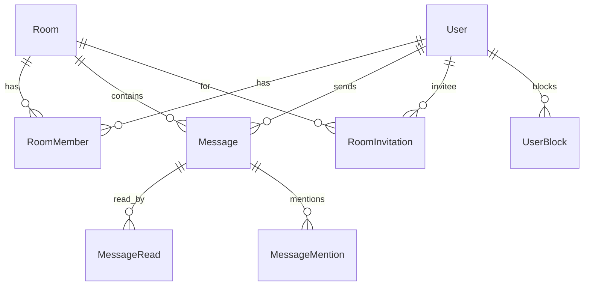

---

## 5. Authentication & accounts

### Password hashing

Passwords use **PBKDF2-HMAC-SHA512** via Werkzeug (not plain SHA-512):

```python
# app/models.py
PASSWORD_HASH_METHOD = "pbkdf2:sha512"

def set_password(self, password):
    self.password_hash = generate_password_hash(password, method=PASSWORD_HASH_METHOD)

def check_password(self, password):
    return check_password_hash(self.password_hash, password)
```

### Registration flow

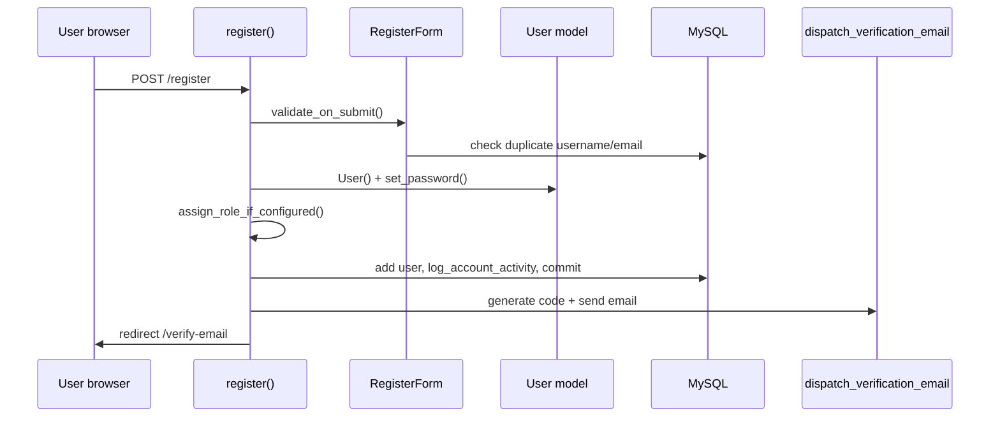

**Route handler:**

```python
# app/routes.py
@main_bp.route("/register", methods=["GET", "POST"])
def register():
    form = RegisterForm()
    if form.validate_on_submit():
        user = User(username=..., email=...)
        user.set_password(form.password.data)
        assign_role_if_configured(user)
        db.session.add(user)
        db.session.flush()
        log_account_activity(action="account_register", ...)
        db.session.commit()
        dispatch_verification_email(user)
        return redirect(url_for("main.verify_email", email=user.email))
    return render_template("register.html", form=form)
```

**Form validation** (`app/forms.py`): required fields, password match, custom checks for unique username/email.

**Verification code** (stored hashed, not plaintext):

```python
# app/models.py
def generate_email_verification_code(self):
    raw_code = f"{secrets.randbelow(1000000):06d}"
    self.verification_token_hash = sha512(raw_code.encode("utf-8")).hexdigest()
    self.verification_token_expires_at = ...
    return raw_code  # sent by email only
```

### Login flow

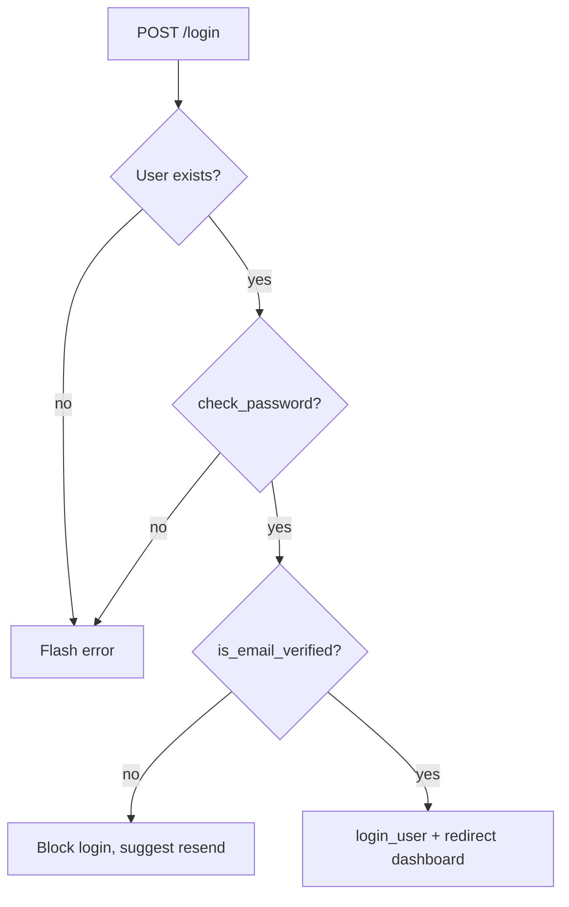

```python
# app/routes.py (excerpt)
if user is None or not user.check_password(form.password.data):
    flash("Invalid email or password.", "error")
elif not user.is_email_verified:
    flash("Verify your email address...", "error")
else:
    login_user(user)
    return redirect(url_for("main.dashboard"))
```

### Role assignment on register

```python
# app/routes.py
def assign_role_if_configured(user):
    if user.email in current_app.config["SUPER_ADMIN_EMAILS"]:
        user.set_role("super_admin")
    elif user.email in current_app.config["ADMIN_EMAILS"]:
        user.set_role("admin")
```

### Flask-Login

- Session cookie identifies the user on HTTP and Socket.IO connections.
- `@login_required` protects routes.
- Socket `connect` rejects unauthenticated clients with `return False`.

---

## 6. Real-time layer (Socket.IO)

### Server registration

All handlers live in `register_socket_events(socketio)` in `app/sockets.py`.

### Online presence (in-memory)

```python
ONLINE_USERS = defaultdict(set)  # user_id -> set of socket session ids (sid)

def get_online_user_ids():
    return {user_id for user_id, sids in ONLINE_USERS.items() if sids}
```

This is **process memory**—not stored in MySQL. Restarting the server clears it.

### Per-user emit helper

```python
def emit_to_user(socketio, user_id, event_name, payload):
    for sid in tuple(ONLINE_USERS.get(user_id, ())):
        socketio.emit(event_name, payload, to=sid)
```

Uses `tuple(...)` so iterating is safe if connect/disconnect mutates the set during emit.

### Connection lifecycle

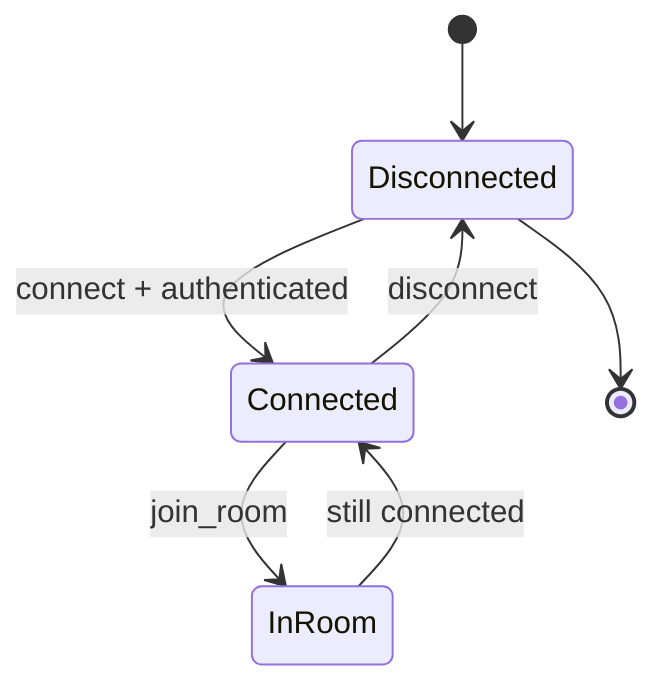

**On connect:**

```python
@socketio.on("connect")
def handle_connect():
    if not current_user.is_authenticated:
        return False
    ONLINE_USERS[current_user.id].add(request.sid)
    emit("presence_snapshot", {"online_user_ids": list(get_online_user_ids())})
    socketio.emit("user_status", serialize_user_status(current_user))
```

**On disconnect:** remove `sid`; if last tab, emit offline `user_status`.

### Room access guard

```python
def get_accessible_room(room_id, user):
    room = db.session.get(Room, int(room_id))
    if room is None:
        return None
    if room.is_private and not room.has_member(user):
        return None
    if room.is_private:
        other_member = room.other_member_for(user)
        if other_member and users_are_blocked(user.id, other_member.id):
            return None
    if not room.is_private and not room.has_member(user):
        room.add_member(user)
        db.session.commit()
    return room
```

### Client: two Socket.IO connections

| Script | When loaded | Purpose |
|--------|-------------|---------|
| `live_notifications.js` | Every authenticated page (`base.html`) | `window.__appSocket` — notifications, profile updates |
| `chat.js` | Dashboard with a room open | Second `io()` — chat, typing, reads |

Both use polling only:

```javascript
// app/static/js/chat.js
const socket = io({
    transports: ["polling"],
    upgrade: false,
});
```

### Joining a chat room (Socket.IO)

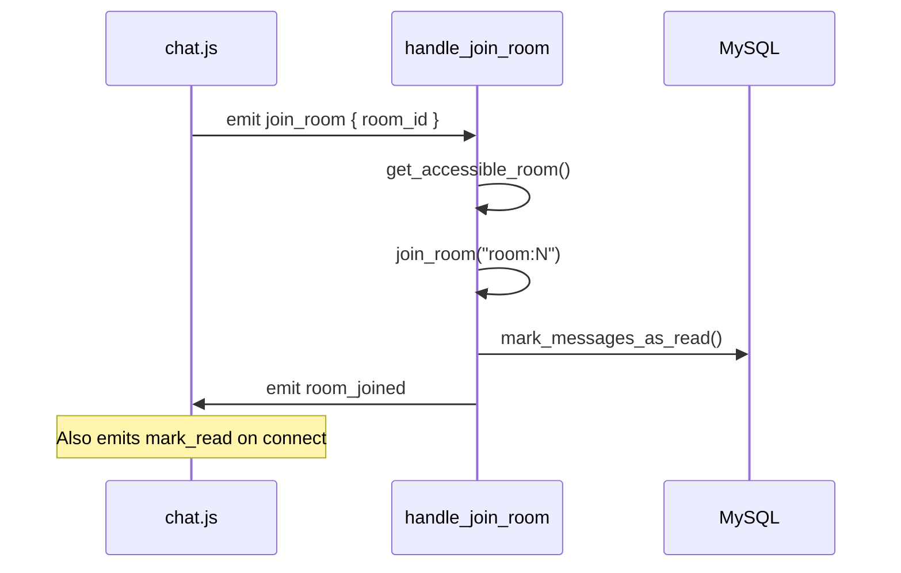

### Sending a message (real-time path)

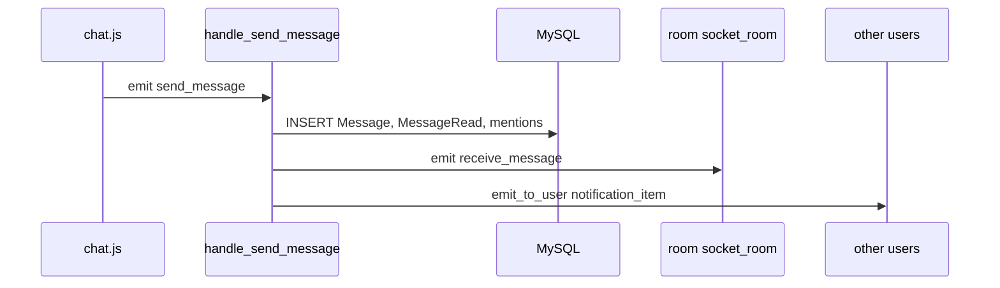

```python
# app/sockets.py (excerpt)
@socketio.on("send_message")
def handle_send_message(data):
    room = get_accessible_room(room_id, current_user)
    message = Message(user=current_user, room=room, content=content, ...)
    db.session.commit()
    socketio.emit("receive_message", serialize_message_payload(message, ...), to=room.socket_room)
    for member in room.members:
        if member.user_id != current_user.id:
            emit_to_user(socketio, member.user_id, "notification_item", ...)
```

### HTTP can also push socket events

Example: media upload after `POST /rooms/<id>/media`:

```python
# app/routes.py (pattern)
socketio.emit("receive_message", payload, to=room.socket_room)
emit_notification_item_for_user(...)
```

---

## 7. Rooms & chat types

### Three room kinds

| Type | How identified | Created by |
|------|----------------|------------|
| **Public** | `Room.is_private == False` (e.g. "General") | `POST /rooms` (`create_room`) |
| **Private group** | `is_private`, name does **not** start with `dm:` | `POST /rooms/private` |
| **Direct message** | `is_private` + name `dm:low_id:high_id` | `POST /private-chats` → `get_or_create_private_room()` |

### Start a direct message

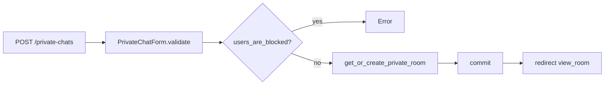

```python
# app/models.py
def get_or_create_private_room(current_user, other_user):
    room_name = Room.private_room_name(current_user.id, other_user.id)
    room = db.session.scalar(select(Room).where(Room.name == room_name))
    if room is None:
        room = Room(name=room_name, is_private=True)
        room.add_member(current_user)
        room.add_member(other_user)
        db.session.add(room)
        db.session.flush()
    return room
```

### Opening a room (HTTP)

```
GET /rooms/<room_id>  →  view_room()  →  build_dashboard_context(room_id)
```

Loads **full message history** from SQLAlchemy, serializes with `serialize_message_payload()`, embeds in `chat-config` JSON for `chat.js`.

### Private room invites

Owner/manager invites by username → `RoomInvitation` row (`status=pending`). See [§10](#10-room-invitations).

---

## 8. Messaging

### Loading history (HTTP)

```python
# app/routes.py — build_dashboard_context()
mark_room_messages_as_read(selected_room, current_user)
initial_messages = [
    serialize_message_payload(message, current_user.id)
    for message in selected_room.messages
]
```

Template embeds config:

```html
<!-- dashboard.html (concept) -->
<script id="chat-config" type="application/json">
  {{ { "roomId": ..., "initialMessages": initial_messages, ... } | tojson }}
</script>
```

`chat.js` calls `renderMessages(config.initialMessages)` on load.

### Live append (Socket.IO)

```javascript
// chat.js
socket.on("receive_message", function (message) {
    if (message.room_id !== config.roomId) return;
    appendMessage(message);
    if (message.user.id !== config.currentUserId) {
        socket.emit("mark_read", { room_id: config.roomId });
    }
});
```

### Typing indicators

| Client | Server |
|--------|--------|
| `typing_start` / `typing_stop` | `handle_typing_*` → `typing_indicator` to `room.socket_room`, `skip_sid=request.sid` |

### Read receipts

| Step | Function |
|------|----------|
| Mark read in DB | `mark_messages_as_read()` — creates `MessageRead` rows |
| Notify room | `emit("message_read", { message_ids, username, ... })` |
| UI update | `chat.js` → `updateReceipts()` |

### @Mentions (group rooms only)

```python
# app/sockets.py
def extract_mentioned_members(room, message_content):
    if room.is_direct_message or len(room.members) <= 2:
        return []
    # regex @username → MessageMention rows + mention notification payload
```

DMs skip mention parsing.

### Media messages

1. User picks file → `fetch POST /rooms/<id>/media`
2. Server saves file, creates `Message` with `message_type` image/video
3. Server `socketio.emit("receive_message", ...)` — same as text socket path

---

## 9. Notifications

### What counts as a notification

Built in `build_notification_items()` from:

- Unread messages in rooms (excluding blocked DMs)
- Unread `@mentions`
- Pending **room invitations**

### Unread count

```python
def get_unread_notification_count(user):
    return len(build_notification_items(user, limit=None))
```

Injected into every template via `@main_bp.app_context_processor` → nav badge.

### Real-time notification delivery

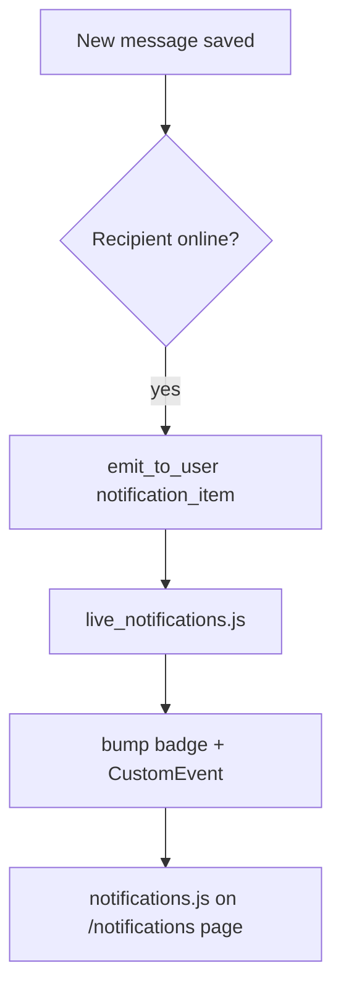

```javascript
// live_notifications.js
socket.on("notification_item", function (payload) {
    bumpBadgeCount();
    window.dispatchEvent(new CustomEvent("app:notification-item", { detail: payload }));
});
```

**Count refresh** (e.g. after invite accept):

```python
def emit_notification_refresh_for_user(user_id):
    emit_to_user(socketio, user_id, "notification_count", {"count": get_unread_notification_count(user)})
```

---

## 10. Room invitations

### Data model constraint

One row per `(room_id, invitee_id)`; status cycles `pending` → `accepted` / `declined`. Re-invite reuses the row (see `invite_to_private_room` in `routes.py`).

### Invite flow

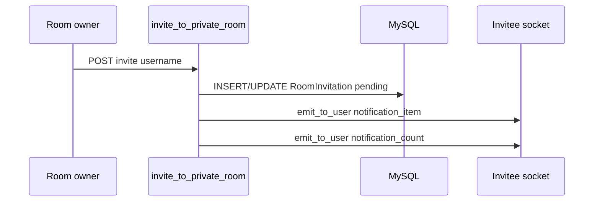

### Accept flow

```python
# app/routes.py (excerpt)
@main_bp.route("/invitations/<id>/accept", methods=["POST"])
def accept_room_invitation(invitation_id):
    room.add_member(current_user)
    invitation.status = "accepted"
    db.session.commit()
    socketio.emit("room_members_updated", ..., to=room.socket_room)
    emit_notification_refresh_for_user(...)
```

---

## 11. User blocking

### Storage

`UserBlock(blocker_id, blocked_id)` — one-directional block.

### Effects

- **DM:** `private_room_is_blocked()` / `get_accessible_room()` returns `None` → chat disabled
- **Dashboard:** blocked users hidden from DM list; person card shows blocked state
- **Invites:** cannot invite blocked users

```python
# app/routes.py
@main_bp.route("/users/<int:user_id>/block", methods=["POST"])
def block_user(user_id):
    db.session.add(UserBlock(blocker_id=current_user.id, blocked_id=target_user.id))
    db.session.commit()
```

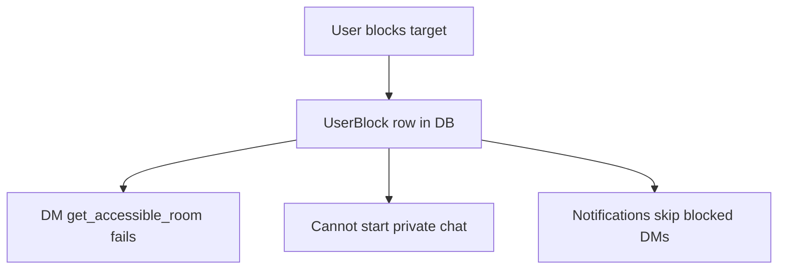

---

## 12. Profiles & media uploads

### Profile update

`POST /profile` → updates `display_name`, `bio`, `avatar_url` (or uploaded file) → `socketio.emit("user_profile_updated", ...)` → `live_notifications.js` → `profile.js` / `dashboard.js` update UI.

### Upload paths

| Config key | Purpose |
|------------|---------|
| `UPLOAD_FOLDER` | Chat images/videos |
| `PROFILE_AVATAR_UPLOAD_FOLDER` | Profile avatars |

---

## 13. Admin dashboard

### Access

`@admin_required` decorator checks `current_user.is_admin` (roles `admin` or `super_admin`).

### Capabilities

- List/search users and rooms
- Create/edit/delete users (with optional password reset)
- Delete rooms
- View per-user audit logs (`AdminAuditLog` + JSON endpoint for modal)

### Audit logging

```python
def log_account_activity(action, target_type=None, target_id=None, details=None, ...):
    db.session.add(AdminAuditLog(actor_id=..., action=action, details=details, ...))
```

Used for register, login, verify, block, admin actions, etc.

---

## 14. Socket events reference

### Client → server

| Event | Handler | Purpose |
|--------|---------|---------|
| `connect` | `handle_connect` | Auth, track `ONLINE_USERS` |
| `disconnect` | `handle_disconnect` | Remove sid, update presence |
| `join_room` | `handle_join_room` | Enter Socket.IO room `room:{id}` |
| `send_message` | `handle_send_message` | Save + broadcast message |
| `typing_start` | `handle_typing_start` | Typing on |
| `typing_stop` | `handle_typing_stop` | Typing off |
| `mark_read` | `handle_mark_read` | Read receipts |

### Server → client

| Event | Typical target | Listened in |
|--------|----------------|-------------|
| `receive_message` | `room:{id}` | `chat.js` |
| `typing_indicator` | `room:{id}` | `chat.js` |
| `message_read` | `room:{id}` | `chat.js` |
| `user_status` | broadcast | `chat.js` |
| `presence_snapshot` | connecting client | *(no JS listener today)* |
| `room_joined` | caller | *(no JS listener today)* |
| `room_members_updated` | `room:{id}` | `chat.js` |
| `notification_item` | user `sid` | `live_notifications.js` |
| `notification_count` | user `sid` | `live_notifications.js` |
| `user_profile_updated` | broadcast / all | `live_notifications.js` |
| `error` | caller | `chat.js` |

---

## 15. HTTP routes reference

| Route | Methods | Feature |
|-------|---------|---------|
| `/` | GET | Landing |
| `/register` | GET, POST | Sign up |
| `/verify-email` | GET, POST | Email verification |
| `/resend-verification` | GET, POST | Resend code |
| `/login` | GET, POST | Sign in |
| `/logout` | POST | Sign out |
| `/dashboard` | GET | Main chat UI |
| `/profile` | GET, POST | Edit own profile |
| `/users/<id>/profile` | GET | View profile |
| `/rooms/<id>` | GET | Open room |
| `/rooms/<id>/media` | POST | Upload image/video |
| `/notifications` | GET | Notification center |
| `/rooms` | POST | Create public room |
| `/private-chats` | POST | Start DM |
| `/rooms/private` | POST | Create private room |
| `/rooms/<id>/invite` | POST | Invite user |
| `/rooms/<id>/members/<uid>/remove` | POST | Kick member |
| `/invitations/<id>/accept` | POST | Accept invite |
| `/invitations/<id>/decline` | POST | Decline invite |
| `/rooms/<id>/delete` | POST | Delete room |
| `/users/<id>/block` | POST | Block user |
| `/users/<id>/unblock` | POST | Unblock user |
| `/admin` | GET | Admin dashboard |
| `/admin/users/...` | * | User CRUD, logs |

---

## Appendix: End-to-end DM example

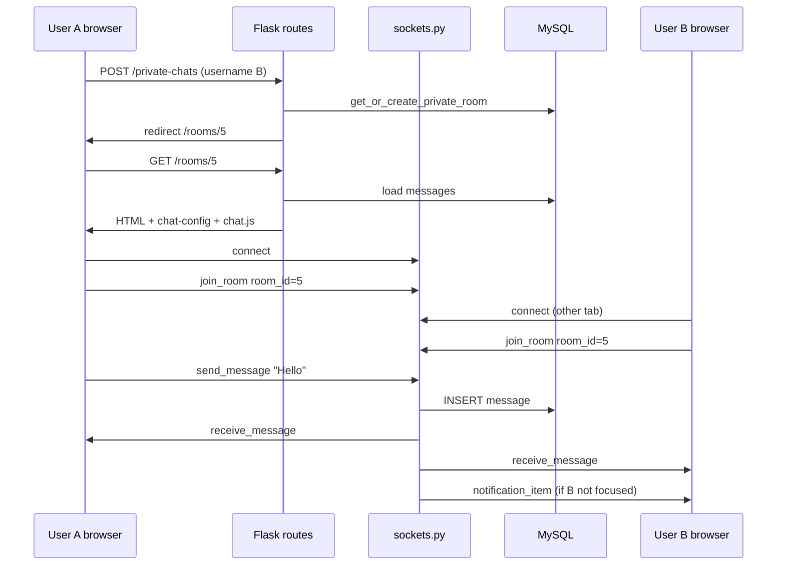

---

## Appendix: Key helper functions map

| Function | File | Role |
|----------|------|------|
| `create_app` | `__init__.py` | App factory |
| `register_socket_events` | `sockets.py` | All socket handlers |
| `get_accessible_room` | `sockets.py` | Room permission check |
| `serialize_message_payload` | `sockets.py` | Message JSON for client |
| `emit_to_user` | `sockets.py` | Target one user's sockets |
| `build_dashboard_context` | `routes.py` | Dashboard + room state |
| `build_notification_items` | `routes.py` | Notification list |
| `get_or_create_private_room` | `models.py` | DM room get/create |
| `users_are_blocked` | `models.py` | Block check |
| `dispatch_verification_email` | `routes.py` | Email on register |
| `log_account_activity` | `routes.py` | Audit trail |

---

*Generated for the `test_real_time_chat` codebase. For environment setup, see `.env.example` and `requirements.txt`.*
